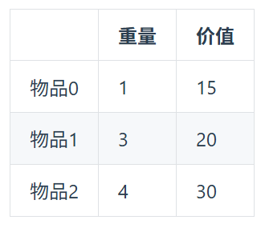
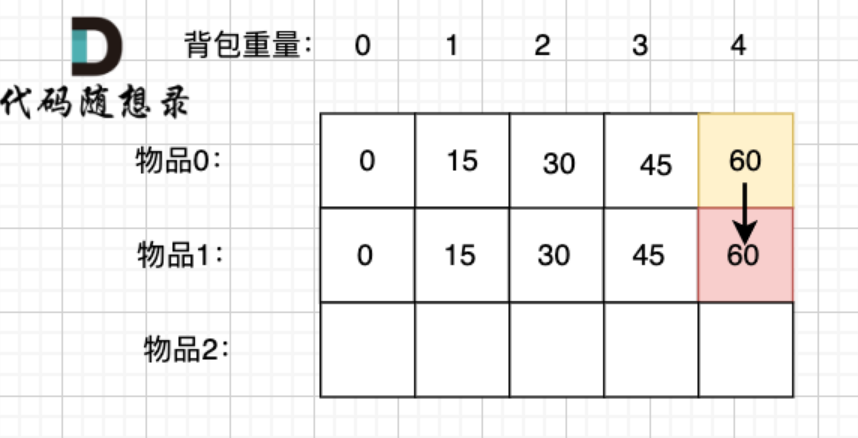
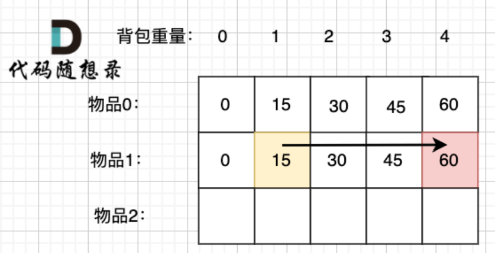

## 完全背包
有N件物品和一个最多能背重量为W的背包。第i件物品的重量是weight[i]，得到的价值是value[i] 。每件物品都有无限个（也就是可以放入背包多次），求解将哪些物品装入背包里物品价值总和最大。

**完全背包和01背包问题唯一不同的地方就是，每种物品有无限件。**

### 1. 确定dp数组下标及其含义

dp[i][j] 表示从下标为[0-i]的物品，每个物品可以取无限次，放进容量为j的背包，价值总和最大是多少。

### 2. 确定递推公式

这里在把基本信息给出来：



对于递推公式，首先我们要明确有哪些方向可以推导出 dp[i][j]。

这里依然拿dp[1][4]的状态来举例： 

求取 dp[1][4] 有两种情况：

放物品1
还是不放物品1
如果不放物品1， 那么背包的价值应该是 dp[0][4] 即 容量为4的背包，只放物品0的情况。

推导方向如图：



如果放物品1， 那么背包要先留出物品1的容量，目前容量是4，物品1 的容量（就是物品1的重量）为3，此时背包剩下容量为1。

容量为1，只考虑放物品0 和物品1 的最大价值是 dp[1][1]， 注意 这里和 01背包理论基础（二维数组） 有所不同了！

在 01背包理论基础（二维数组） 中，背包先空留出物品1的容量，此时容量为1，只考虑放物品0的最大价值是 dp[0][1]，因为01背包每个物品只有一个，既然空出物品1，那背包中也不会再有物品1！

而在完全背包中，物品是可以放无限个，所以 即使空出物品1空间重量，那背包中也可能还有物品1，所以此时我们依然考虑放 物品0 和 物品1 的最大价值即： dp[1][1]， 而不是 dp[0][1]

所以 放物品1 的情况 = dp[1][1] + 物品1 的价值，推导方向如图：



两种情况，分别是放物品1 和 不放物品1，我们要取最大值（毕竟求的是最大价值）

dp[1][4] = max(dp[0][4], dp[1][1] + 物品1 的价值)

以上过程，抽象化如下：

不放物品i：背包容量为j，里面不放物品i的最大价值是dp[i - 1][j]。

放物品i：背包空出物品i的容量后，背包容量为j - weight[i]，dp[i][j - weight[i]] 为背包容量为j - weight[i]且不放物品i的最大价值，那么dp[i][j - weight[i]] + value[i] （物品i的价值），就是背包放物品i得到的最大价值

递推公式： dp[i][j] = max(dp[i - 1][j], dp[i][j - weight[i]] + value[i]);

（注意，完全背包二维dp数组 和 01背包二维dp数组 递推公式的区别，01背包中是 dp[i - 1][j - weight[i]] + value[i]）

### 3. dp数组如何初始化

关于初始化，一定要和dp数组的定义吻合，否则到递推公式的时候就会越来越乱。

首先从dp[i][j]的定义出发，如果背包容量j为0的话，即dp[i][0]，无论是选取哪些物品，背包价值总和一定为0。

再看其他情况。

状态转移方程 dp[i][j] = max(dp[i - 1][j], dp[i][j - weight[i]] + value[i]); 可以看出有一个方向 i 是由 i-1 推导出来，那么i为0的时候就一定要初始化。

dp[0][j]，即：存放编号0的物品的时候，各个容量的背包所能存放的最大价值。

那么很明显当 j < weight[0]的时候，dp[0][j] 应该是 0，因为背包容量比编号0的物品重量还小。

当j >= weight[0]时，dp[0][j] 如果能放下weight[0]的话，就一直装，每一种物品有无限个。

### 4. 确定遍历顺序

01背包理论基础（二维数组） 中我们讲过，01背包二维DP数组，先遍历物品还是先遍历背包都是可以的。

因为两种遍历顺序，对于二维dp数组来说，递推公式所需要的值，二维dp数组里对应的位置都有。

详细可以看 01背包理论基础（二维数组） 中的 【遍历顺序】的讲解

所以既可以 先遍历物品再遍历背包，也可以 先遍历背包再遍历物品。

但是在完全背包问题中， 我们要知道，排列和组合的差别，如果一道题目求的是**排列**的数量，那么遍历时就应该**先遍历背包再遍历物品**，而且递推公式应改为

dp[i][j] = dp[i - 1][j] + dp[-1][j - weight[i]](因为排列时选择元素是要在所有元素中选择，所以是dp[-1]，**i = 0的情况也不必初始化**。这一段很难理解，其实是因为二维dp数组天然与排列的定义相矛盾，用一维dp数组比较合适)

如果是求**组合的数量**，那么如果用二维数组，那就都可以，用一维数组则必须**先遍历物品再遍历背包**， 递推公式不用变。

## 题目

### 52. 携带研究材料（卡码）


小明是一位科学家，他需要参加一场重要的国际科学大会，以展示自己的最新研究成果。他需要带一些研究材料，但是他的行李箱空间有限。

这些研究材料包括实验设备、文献资料和实验样本等等，它们各自占据不同的重量，并且具有不同的价值。

小明的行李箱所能承担的总重量是有限的，问小明应该如何抉择，才能携带最大价值的研究材料，每种研究材料可以选择无数次，并且可以重复选择。

**输入描述：**

```
第一行包含两个整数，n，v，分别表示研究材料的种类和行李所能承担的总重量 

接下来包含 n 行，每行两个整数 wi 和 vi，代表第 i 种研究材料的重量和价值
```

**输出描述：**

```
输出一个整数，表示最大价值。
```

**输入示例：**

```
4 5
1 2
2 4
3 4
4 5
```

**输出示例：**

```
10
```
#### 二维数组

**题目分析：**

这就是一个完全背包问题，和之前的01背包问题的分析是一致的，我接下来用二维和一维dp数组分别做一遍。

首先是二维数组，分析：

1. dp数组的下标及其含义： dp[i][j] 从0 - i 中选择物品放入容量为j的背包中，背包的最大价值

2. dp数组的递推公式：

对于第i个物品来讲，

如果第i个物品的重量weight[i]大于背包容量j, 那么显然背包中是放不下这个物品的，此时dp[i][j] = dp[i - 1][j]

如果第i个物品的重量weight[i]小于背包容量j, 那么如果我们要放入这个物品，此时dp[i][j] = dp[i][j - weight[i]] + value[i]（要放入这个物品的话，因为是无限个物品，所以从dp[i][j - weight[i]]中选）

如果我们不要放入这个物品，此时dp[i][j] = dp[i - 1][j]

所以综上，递推公式为：

if j < weight[i]:
    dp[i][j] = dp[i - 1][j]
else:
    dp[i][j] = max(dp[i - 1][j], dp[i][j - weight[i]] + value[i])

3. dp数组初始化

对于这个dp数组的初始化，因为前面的递推公式中存在i - 1和j - weight[i]，所以我们应该初始化i = 0 和j = 0的情况

当j = 0时，此时背包的容量为0，无法放入任何物品，那么显然对于任何的i，dp[i][0] = 0

当i = 0时，此时只需要将物品0放入背包中，但是我们要注意物品0是可以无限放入的，那么当背包容量j 大于等于 weight[0] 时，dp[0][j] = value[0] * (j // weight[0])

4. 遍历顺序

这并非组合问题也并非排序问题，所以我们先遍历哪个都是可以的

**代码：**

```python
import sys

def solve(n, v, weight, value):
    dp = [[0] * (v + 1) for _ in range(n)]
    for j in range(weight[0], v + 1):
        dp[0][j] = value[0] * (j // weight[0])
    for i in range(1, n):
        for j in range(v + 1):
            if j < weight[i]:
                dp[i][j] = dp[i - 1][j]
            else:
                dp[i][j] = max(dp[i - 1][j], dp[i][j - weight[i]] + value[i])
    return dp[-1][-1]

if __name__ == "__main__":
    data = list(map(int, sys.stdin.readline().strip().split()))
    n = data[0]
    v = data[1]
    weight = [0] * n
    value = [0] * n
    for i in range(n):
        data = list(map(int, sys.stdin.readline().strip().split()))
        weight[i], value[i] = data[0], data[1]
    print(solve(n, v, weight, value))


```

#### 一维数组
用一维数组会比二维数组写的快一些，但是理解起来不太容易，和01背包问题的一维数组相比，差别就是**01背包问题用一维数组时的遍历顺序必须是先物品后背包，而且背包顺序需要倒序**，

**完全背包的一维数组遍历顺序可以换，背包顺序也不需要倒序**

1. dp数组的下标及其含义： dp[j] 向容量为j的背包中放物品，所能得到的最大价值

2. 递推公式：

dp[j] = max(dp[j], dp[j - weight[i]] + value[i])

3. 初始化

dp = [[0] * (背包容量 + 1)]

4. 遍历顺序

先遍历物品还是先遍历背包都可以

**代码：**

```python
import sys

def solve(n, v, weight, value):
    dp = [0] * (v + 1)
    for i in range(n):
        for j in range(weight[i], v + 1):
            dp[j] = max(dp[j], dp[j - weight[i]] + value[i])
    return dp[-1]

if __name__ == "__main__":
    data = list(map(int, sys.stdin.readline().strip().split()))
    n, v = data[0], data[1]
    weight , value = [0] * n, [0] * n
    for i in range(n):
        data = list(map(int, sys.stdin.readline().strip().split()))
        weight[i], value[i] = data[0], data[1]
    print(solve(n, v, weight, value))


```

### 518. 零钱兑换 II

给你一个整数数组 coins 表示不同面额的硬币，另给一个整数 amount 表示总金额

请你计算并返回可以凑成总金额的硬币组合数。如果任何硬币组合都无法凑出总金额，返回 0 。

假设每一种面额的硬币有无限个。 

题目数据 保证 最终 结果符合 32 位 带符号整数。


**示例1：**

输入：

```
5

1 2 5
```

输出:

```
4
```

解释：

```
有四种方式可以凑成总金额：

5=5

5=2+2+1

5=2+1+1+1

5=1+1+1+1+1
```

**示例2：**

输入：

```
3
2
```

输出：

```
0
```

解释：

```
只用面额 2 的硬币不能凑成总金额 3
```

#### 二维数组

对于这道题，实际上就是一个在coins数组中选元素放入容量为amount的背包中，看有多少种方法。

这是一个找组合的问题，所谓组合，就是一个组合中元素的顺序无所谓，例如[1, 2, 2]和[2, 1, 1]是同一个组合

这里的coins数组其实就是weight数组

前面讲过，**对于组合问题，二维数组的遍历顺序是不重要的，只需要正常求解即可**

1. dp数组的下标及其含义： dp[i][j] 是指从0 - i中选择元素 填满容量为 j 的背包 有多少种方法

2. 递推公式： 

对于物品i而言，如果它的重量weight[i] > j， 那么这个物品显然无法放入背包中， 此时 dp[i][j] = dp[i - 1][j]

如果它的重量weight[i] <= j，那么这个物品可以放入背包中， 此时又分为两种情况

当选择放入这个物品时，dp[i][j] = dp[i][j - weight[i]]

当选择不放入这个物品时，dp[i][j] = dp[i - 1][j]

3. 初始化

这里有

i -1以及j - weight[i]，所以i = 0和j = 0是需要初始化的

当j = 0时，显然此时有一种方法，那就是什么都不放，可以填满这个容量为0的背包（因为硬币的面额没有0，如果有0的话那就是另一种情况了）

当i = 0时，也就是把硬币0放入背包中，看有多少种方法，显然只要背包容量j能整除weight[0],这个背包就能被填满，就有一种方法，如果不能整除那就不能填满，就只有0种方法

综上，初始化方法为：
for i in range(len(coins)):
    dp[i][0] = 1

for j in range(1, amount + 1):
    if j % weight[0] == 0:
        dp[0][j] = 1

4. 遍历顺序

前面讲过了，对于二维dp数组来说，组合问题不必在意遍历顺序。

**代码：**

```python
import sys

def solve(amount, coins):
    if min(coins) > amount:
        return 0
    m = len(coins)
    n = amount
    weight = coins
    dp = [[0] * (n + 1) for _ in range(m)]

    for i in range(m):
        dp[i][0] = 1
    for j in range(1, n + 1):
        if j % weight[0] == 0:
            dp[0][j] = 1
    for i in range(1, m):
        for j in range(n + 1):
            if j < weight[i]:
                dp[i][j] = dp[i - 1][j]
            else:
                dp[i][j] = dp[i - 1][j] + dp[i][j - weight[i]]
    return dp[-1][-1]

if __name__ == "__main__":
    amount = int(sys.stdin.readline().strip())
    coins = list(map(int, sys.stdin.readline().strip().split()))
```
#### 一维数组

对于这道题，我们采用一维数组的话，要是注意遍历顺序的问题了，这是一个组合问题，那么我们只能先遍历物品后遍历背包

1. dp数组下标及其含义： dp[j] 表示将硬币选择放入容量为j的背包中，填满背包有多少种方法

2. dp数组的递推公式：dp[j] = dp[j] + dp[j - weight[i]]（其实也是有二维数组递推公式压缩简化得到的）

3. 初始化：这里要求的是最大方法数量，所以我们把dp数组初始化为0就可以了,另外就是当j = 0的时候，填满的方法应该只有一种---就是不填，所以dp[0]应该为1

4. 遍历顺序：前面讲过了，对于完全背包问题的一维数组，求组合数量时，只能先遍历物品后遍历背包

**代码：**

```python
import sys

def solve(amount, coins):
    m = len(coins)
    n = amount
    dp = [0] * (n + 1)
    dp[0] = 1
    for i in range( m):
        for j in range(coins[i], n + 1): #完全背包问题 不用倒序遍历
            dp[j] = dp[j] + dp[j - coins[i]]
    return dp[-1]
if __name__ == "__main__":
    amount = int(sys.stdin.readline().strip())
    coins = list(map(int, sys.stdin.readline().strip().split()))
    print(solve(amount, coins))
```

### 377. 组合总和IV

给你一个由 不同 整数组成的数组 nums ，和一个目标整数 target 。请你从 nums 中找出并返回总和为 target 的元素组合的个数。

题目数据保证答案符合 32 位整数范围。

**示例1：**

输入：

```
1 2 3
4
```

输出：

```
7
```

解释：

```
所有可能的组合为：
(1, 1, 1, 1)
(1, 1, 2)
(1, 2, 1)
(1, 3)
(2, 1, 1)
(2, 2)
(3, 1)
请注意，顺序不同的序列被视作不同的组合。
```

输入：

```
9
3
```

输出：

```
0
```

#### 二维数组

**题目分析：**

这就是一个完全背包问题的排列问题，和上题是很像的，不同的是这里会把不同顺序的序列也视为一个组合，即[1, 2, 3] 和[1, 3, 2]会被视为不同的排列，这里其实我们要注意的是

排列和二维数组天然就是有矛盾的，所以用二维数组去做完全背包的排列问题虽然能做但是比较难以理解。

1. dp数组下标及其含义：dp[i][j] 指从0-i中选择元素放入容量为j的背包中，能填满容量为j的背包的数量

2. 递推公式：

对于元素i，如果weight[i] > j, 那显然i是无法放入背包中的，此时dp[i][j] = dp[i - 1][j]

反过来，如果weight[i] <= j, 此时如果我们选择不将i放入背包中，此时就有dp[i][j] = dp[i - 1][j]

如果我们将i放入背包中，有dp[i][j] = dp[-1][j - weight[i]] （这里我是这样理解的，如果要将物品i放入背包中的话，此时我们先在背包中减去一个物品i所占的空间，就变成了将所有物品放入容量为j - weight[i]的一个新问题，所以要用全部的物品去装填。）

3. 初始化

这里有j - weight[i]和i - 1，但是我们要记住排列问题时i = 0不能按物品0来初始化，而是要用全部全部的物品来初始化，也就是dp[-1] ，实际上就不需要特别初始化一下i = 0

虽然不存在j = 0的情况，但是我们需要这个来进行递推，所以我们还是需要初始化dp[i][0] = 1

综上

初始化就是dp[i][0] = 1

4. 遍历顺序

上面已经讲过了，对于完全背包问题排列问题，必须要先遍历背包容量后遍历物品

**代码：**

```python

import sys

def solve(nums, target):
    m = len(nums)
    n = target
    dp = [[0] * (n + 1) for _ in range(m)]
    for i in range(m):
        dp[i][0] = 1
    for j in range(n + 1):
        for i in range(1, m):
            if nums[i] > j:
                dp[i][j] = dp[i - 1][j]
            else:
                dp[i][j] = dp[i - 1][j] + dp[-1][j - nums[i]]
    return dp[-1][-1]

if __name__ == "__main__":
    nums = list(map(int, sys.stdin.readline().strip().split()))
    target = int(sys.stdin.readline().strip())
    print(solve(nums, target))

```

#### 一维数组

**题目分析：**

1. dp数组的下标及其含义：dp[j] 表示将硬币选择放入容量为j的背包中，填满背包有多少种方法

2. 递推公式：dp[j] = dp[j] + dp[j - weight[i]]（其实这个递推公式也是从二维数组那里压缩简化得来的）

3. 初始化：dp[0] = 1, dp[1:] = 0

4. 遍历顺序： 前面已经讲过，对于完全背包的排列问题，遍历顺序需要先遍历背包后遍历物品

**代码：**

```python

import sys

def solve(nums, target):
    m = len(nums)
    n = target
    dp = [0] * (n + 1)
    dp[0] = 1
    for j in range(n + 1):
        for i in range(m):
            if j >= nums[i]:
                dp[j] = dp[j] + dp[j - weight[i]]
    return dp[-1]

if __name__ == "__main__":
    nums = list(map(int, sys.stdin.readline().strip().split()))
    target = int(sys.stdin.readline().strip())
    print(solve(nums, target))
```

### 57. 爬楼梯 进阶（卡码）

假设你正在爬楼梯。需要 n 阶你才能到达楼顶。 

每次你可以爬至多m (1 <= m < n)个台阶。你有多少种不同的方法可以爬到楼顶呢？ 

注意：给定 n 是一个正整数。

**输入描述：**

输入共一行，包含两个正整数，分别表示n, m

**输出描述：**

输出一个整数，表示爬到楼顶的方法数。

**输入示例：**

3 2

**输出示例：**

3

**题目分析：**

这道题可以看成是完全背包问题排列的应用，我们将[1, 2, ..., m]视为nums数组，将n视为target，即可用上题的模板解出来，这里我只用一维解一遍

**代码：**

```python
import sys

def solve(n, m):
    nums = [i + 1 for i in range(m)]
    dp = [0] * (n + 1)
    dp[0] = 1
    for j in range(n + 1):
        for i in range(m):
            if j >= nums[i]:
                dp[j] = dp[j] + dp[j - nums[i]]
    return dp[-1]

if __name__ == "__main__":
    data = list(map(int, sys.stdin.readline().strip().split()))
    n, m = data[0], data[1]
    print(solve(n, m))
```


