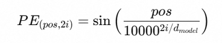
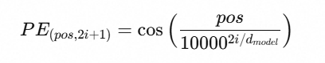
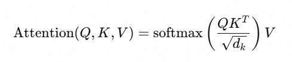

## Transformer结构

Transformer一可分为8个模块

1. input embedding ，它主要由Token embedding 和 positional encoding即Token编码器和位置编码器两部分组成，负责将输入进来的词token转化为一批带位置信息的向量，他的输入

是词token和向量维数d_model，输出一个矩阵，词token数量vocab_size行, d_model列


对于一个想搞AI方向的人来说，手撕一遍Transformer是一个必须要做的事情，我也一直想做，今天就不拖延了，开干！

### 1. input embedding 

前面给讲过了，input embedding主要由Token embedding 和 positional encoding组成，负责将输入进来的词token转化为一批带位置信息的向量，他的输入是词token和

向量维数d_model，输出一个矩阵，词token数量vocab_size行, d_model列。

**Token Embedding:**

```python
import torch
import torch.nn as nn
import math

class Tokenembedding(nn.Model):#nn.Model是继承的神经网络基类，继承之后就自动拥有了可训练的参数管理和前向传播能力

    def __init__(self, vocab_size, d_model): #创建对象
        '''
        Args:
        vocab_size: token数量
        d_model: 每个token转化的词向量维度
        '''
        super().__init__() #必须的 初始化父类
        # nn.Embedding本质上就是一个可学习的查找表
        self.embedding = nn.Embedding(vocab_size, d_model) #创建一个embedding对象，也就是初始化了一个大小为(vocab_size,d_model)的矩阵
        self.d_model = d_model #将维度实例化
    
    def forward(self, x:torch.Tensor):
        return self.embedding(x) * math.sqrt(self.d_model) #这里让embedding之后的向量乘以一个sqrt(dmodel) 是为了扩大词向量的值，避免在位置编码时它的信息被淹没掉

```

**Positional Encoding:**

Transformer的位置编码公式如下：

**对于偶数维度：**


**对于奇数维度：**


```python
import torch
import torch.nn as nn
import math
class PositionalEncodding(nn.Model):

    def __init__(self, d_model, max_len, dropout):
        '''
        Args:
            d_model:模型维度
            max_len:最大支持的序列长度
            dropout:丢弃率
        '''
        super().__init__()
        self.dropout = nn.Dropout(p = 0.1)

        #预计算一个位置编码矩阵
        #这个矩阵在训练过程中不会更新，不是参数
        pe = torch.zeros(max_len, d_model)  

        #position:(max_len, 1) ----表示每个位置0, 1, 2, ..., max_len - 1
        #unsqueeze(1)表示要在第1个位置加一个维度，unsqueeze(1)就代表要在第1维加一个空气维度，这样就变成了列向量
        position = torch.arange(0, max_len, dtype = torch.float).unsqueeze(1)

        #div_term计算缩放因子
        #公式中的 10000^(2i/d_model)，用 exp + log 来稳定计算
        # torch.arange(0, d_model, 2) 取偶数索引: 0, 2, 4, ...
        div_term = torch.exp(torch().arrange(0, d_model, 2).float() * (-math.log(10000.0) / d_model))

        # 偶数维度用 sin，奇数维度用 cos
        pe[:,0::2] = torch.sin(position * div_term)
        pe[:,1::2] = torch.cos(position * div_term)

        # 增加 batch 维度 → (1, max_len, d_model)，方便广播
        pe = pe.unsqueeze(0)

        # register_buffer: 不是可学习参数，但会跟随模型自动切换设备（CPU/GPU）
        # 并且会被包含在 model.state_dict() 中，方便保存和加载
        self.register_buffer('pe', pe)
    
    def forward(self, x:torch.Tensor):
        """
        Args:
            x: shape (batch, seq_len, d_model) 的 token embedding 输出
        Returns:
            shape (batch, seq_len, d_model)，加上了位置编码
        """
        # x.shape = (batch, seq_len, d_model)
        # self.pe[:, :x.size(1), :] = (1, seq_len, d_model)
        # 广播相加后仍然是 (batch, seq_len, d_model)
        #:x.size(1) 就是切片操作 截取前x.size(1)个元素
        x = x + self.pe[:,:x.size(1),:]
        return self.dropout(x)
    
```

**组合起来：**

```python
import torch
import torch.nn as nn
import math
class InputEmbedding(nn.moudle):
    def __init__(self, vocab_size, d_model, max_len, dropout):
        super().__init__()
        self.token_emb = Tokenembedding(vocab_size, d_model)
        self.pos_enc = Positionalencoding(d_model, max_len, dropout)
    def forward(self, x:torch.Tensor):
        '''
        Args:
        x:(batch, seqlen)的token序列
        Returns:
        (batch, seqlen, dmodel)的带位置信息的向量表示
        '''
        return self.pos_enc(token_emb(x))
```

### 2. Multi-Head self-Attention

下面是Transformer中最出名的多头注意力机制

让我们从底层往上搭，分三步走

首先是单头注意力

这是所有注意力操作的原子公式



**Scaled Dot-Product Attention缩放点击
注意力代码：**

```python
import torch
import torch.nn as nn
import torch.nn.functional as F
import math

def scaled_dot_product_attention(
    Q:torch.Tensor, 
    K:torch.Tensor, V:torch.Tensor, 
    mask:torch.Tensor = None) -> tuple([torch.Tensor, torch.Tensor]):
    """
    缩放点积注意力
    
    Args:
        Q: Query 矩阵
        K: Key 矩阵  
        V: Value 矩阵
        mask: 掩码，用于屏蔽某些位置（如 decoder 中屏蔽未来位置）
    
    Returns:
        output: 注意力输出
        attn_weights: 注意力权重（可用于可视化）
    """
    d_k = Q.size(-1)
    
    # Step 1: 计算注意力分数 QK^T
    # Q: (batch, num_heads, seq_len, d_k)
    # K: (batch, num_heads, seq_len, d_k)
    # K.transpose(-2, -1): (batch, num_heads, d_k, seq_len)
    # scores: (batch, num_heads, seq_len, seq_len)
    # 含义：第 i 行第 j 列 = 第 i 个 token 对第 j 个 token 的原始注意力分数
    scores = torch.matmul(Q, K.transpose(-2, -1)) / math.sqrt(d_k)
    
    # Step 2: 如果有 mask，把被遮蔽的位置设为 -inf
    # 这样 softmax 之后这些位置的权重就是 0
    if mask is not None:
        scores = scores.masked_fill(mask == 0, float('-inf'))
    
    # Step 3: softmax 归一化，得到注意力权重
    # 每一行加起来等于 1，表示"对各个位置的关注度分配"
    attn_weights = F.softmax(scores, dim=-1)
    
    # Step 4: 用注意力权重对 V 加权求和
    # attn_weights: (batch, num_heads, seq_len, seq_len)
    # V:            (batch, num_heads, seq_len, d_v)
    # output:       (batch, num_heads, seq_len, d_v)
    # 含义：每个 token 的输出 = 所有 token 的 value 的加权组合
    output = torch.matmul(attn_weights, V)
    
    return output, attn_weights

```